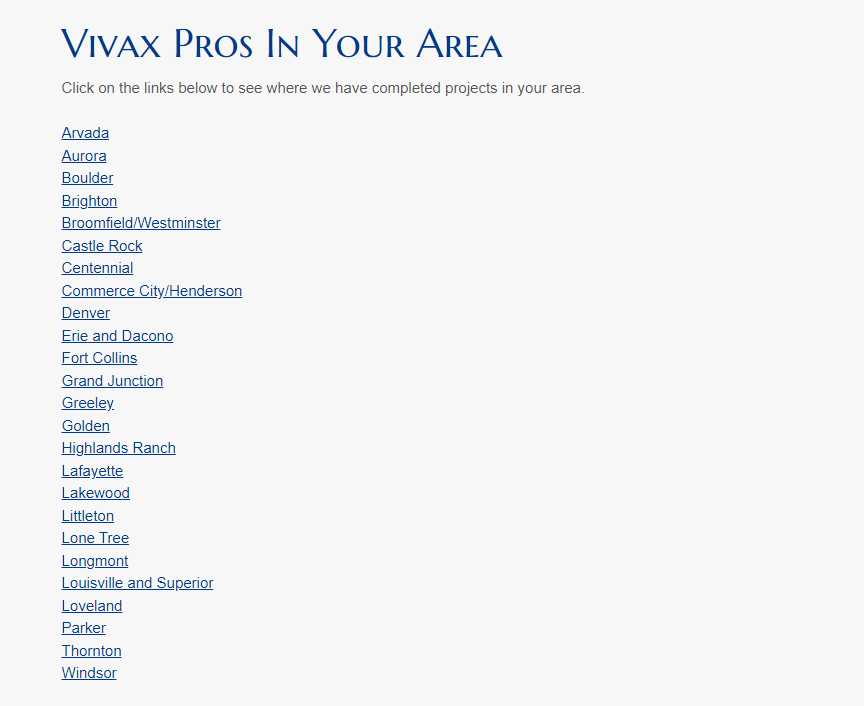

# In Your Area

## Description
In you area proof of concept for dynamic website mapping. Using Vivax Pros' "In Your Area" as base concept to re-design to a dynamically rendered map. Currently uses links to bring user to separate page with static map. Redesign would bring users to a single page that uses geolocation to render current location. User would be able to re-position map if not in correct area.

## Existing Webpage
The existing webpage can be found at https://vivaxpros.com/in-your-area/. Webpage currently uses static links that will be removed once dynamic webpage is complete.

## Deployed Proof-of-Concept
There is currently now deployed project yet. Estimated deployment is the week of 1/17/2022.

## Questions

Email all questions to the following: bbridgesdev@gmail.com

You can connect with me on [GitHub here](https://github.com/bcbridges)!
